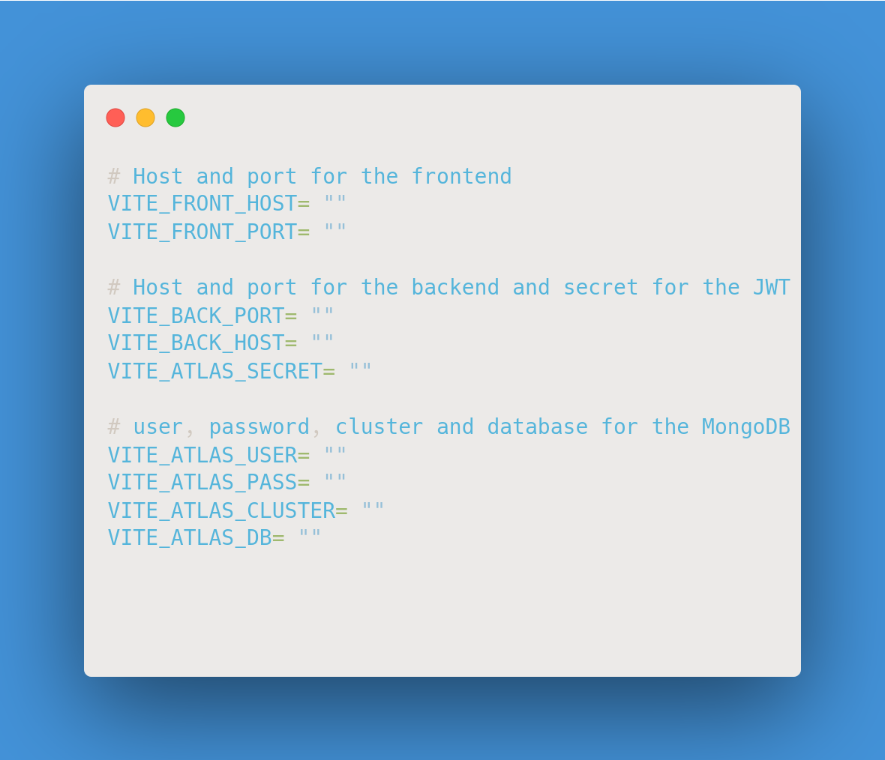

# Instalacion

1. Clona este repositorio en tu máquina local.
2. Asegúrate de tener instalado Node.js
3. Crea un archivo .env
4. Copia las variables de entorno del archivo `.env.example` y pegalas en el archivo `.env` que creaste.

`Nota`: porfavor llena los campos vacios con la informacion correspondiente.

