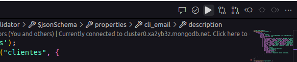

# Instalacion

1. Clona este repositorio en tu máquina local.
2. Asegúrate de tener instalado Node.js, la version utilizada en este proyecto fué:  `node` `v20.9.0`
3. Crea un archivo .env
4. Copia las variables de entorno del archivo `.env.example` y pegalas en el archivo `.env` que creaste.

`Nota`: porfavor llena los campos vacios con la informacion correspondiente.

`Recuerda que la informacion solitada la debes ingresar entre las "" correspondientes`


5. Abre una terminal


presiona en neva terminal:


6. Ejecuta el comando `npm install` para instalar las dependencias del proyecto


7. Ejecuta el comando `npm run start` para iniciar el servidor


---

1. ¡Felicitaciones!, ya has iniciado el servidor y la base de datos y puedes proceder a utilizar los endpoints

2. `NOTA`: Para utilizar los endpoints recuerda que debes tener un token que se genera con el endpoint `/login` (en la siguienta parte se te muestra como puedes pedir el token y utilizarlo)

# Creación de la base de datos

Entra en el archivo `query.mongodb` en la carpeta DB deberías tener esto:


presiona en el icono de play que se encuentra en la parte superior derecha, para crear toda la base de datos así:



deberías obtener una respuesta como está:


### Observacion: Para utilizar los endpoints y generar los token debes tener ThunderClient instalado en visual studio code

- **Autorización**

  `NOTA`: Antes de utilizar cualquier endpoint debes pedir primero un token de autorizacion.

  `_Obeservacion` el token solamente dura `3h` después de este tiempo tendrás que pedir otro

Para generar un token es mediante el correo y la contraseña del usuario enviado la por el body con un method `POST`

`Observacion`: El correo y la contraseña se envia como este ejemplo:

```json
{
  "correo": "ejemplo@example.com",
  "contraseña": "ejemplo123"
}
```

`Observacion`: El correo y la contraseña se envian como string


si el usuario no está previamente registrado, mostrará un error `403` y deberás registrarlo en la base de datos para poder generar el token. **(Más adelante se muestra como registrar un usuario)**; Aquí se muestra el error


Si el usuario está registrado, se generará un token de autorización que deberás utilizar para acceder a los endpoints protegidos.


`NOTA`: No olvides reemplazar el `localhost` por la ip de tu servidor y el `5050` por el puerto que hayas definido en las variables de entorno, u/o que se estes utilizando.

```shell
  http://localhost:5050/login
```

- Implementación del Token

  

- Tendrás un token parecido a esto así, ejemplo:

  - `iJIUzI1NiIsInR5cCI6IkpXVCJ9.eyJpZCI6IYZNkgMMMgYWVMTlNDCIsImlhdCI6MTY5MzI0Mzc3NywiZXhwIjoxNjkzMjU0NTc3fQ.uaWqrDM64Nrj0lRLx4Vn6E0tGBjJf9P`

- Luego debe colocar en la pestaña Headers de la siguiente manera:
- donde dice `header` escribe `Authorization` y pulsa en el recuadro para que se active el envió del token de autorización, así:


- Coloca la palabra `Bearer` y un espacio, luego pega el token que habias copiado previamente, :

  

- Una vez que hayas implementado el token puedes proceder a utilizar los endpoints.


**TENER EN CUENTA:**

`NOTA`: recuerda que el token solamente dura `3h` después de este tiempo tendrás que pedir otro

`NOTA`: Si presentas algun error al momento de solicitar el token, revisa que hayas ingresado correctamente los datos, si el error persiste, revisa que estes escribriendo correctamente la palabra `Bearer`

- **LIMITES DE PETICION DE ENPOINTS**

  `NOTA`: Los endpoints tienen un limite de peticiones, si se excede el limite de peticiones por minuto, el servidor respondera con un error 429, si esto sucede, espera y vuelve a intentarlo.
  **Cabe mencionar que el limit para cada endpoint es distinto por lo tanto no se proporciona informacion de cuanto tiempo tendrás que esperar para volver a intentarlo**

  `Observacion`: Para el enpoint de `/login` tienes 3 intentos, después de eso tendrás que esperar una hora para volver a intentarlo.

# Endpoints

## Ventas

> 1. Listar todas las ventas que se realizaron en el mes de julio de 2023.

**Detalles de la API**

  - Metodo: `GET`
  - URL: `http://localhost:5050/ventas/fecha?año=2023&mes=07&dia=01`
  - Version: `1.0.0`

**Capturas de Pantalla**

  

`Observacion`: Está solicitud se puede utilizar para obtener las ventas de un año un mes o un dia en especifico