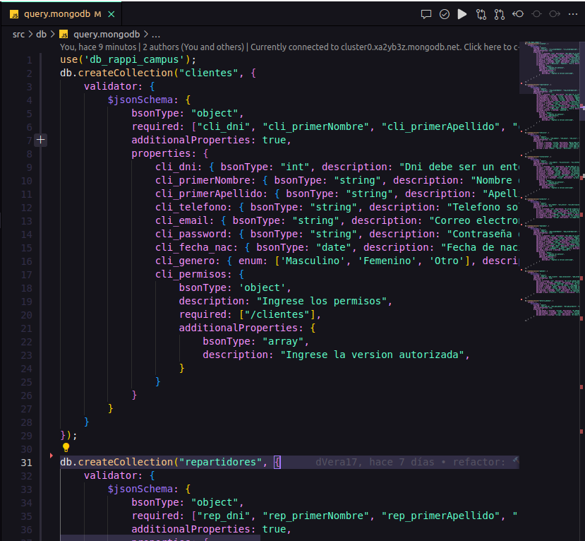
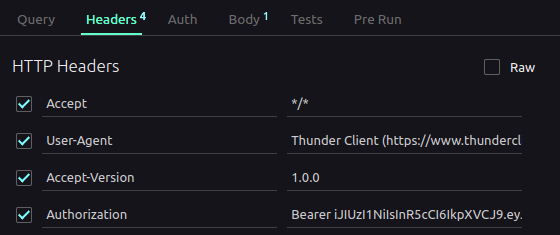

# Instalacion

1. Clona este repositorio en tu máquina local.
2. Asegúrate de tener instalado Node.js, la version utilizada en este proyecto fué: `node` `v20.9.0`
3. Crea un archivo .env
4. Copia las variables de entorno del archivo `.env.example` y pegalas en el archivo `.env` que creaste.

`Nota`: porfavor llena los campos vacios con la informacion correspondiente.

`Recuerda que la informacion solitada la debes ingresar entre las "" correspondientes`


5. Abre una terminal


presiona en neva terminal:


6. Ejecuta el comando `npm install` para instalar las dependencias del proyecto


7. Ejecuta el comando `npm run start` para iniciar el servidor


---

1. ¡Felicitaciones!, ya has iniciado el servidor y la base de datos y puedes proceder a utilizar los endpoints

2. `NOTA`: Para utilizar los endpoints recuerda que debes tener un token que se genera con el endpoint `/login` (en la siguienta parte se te muestra como puedes pedir el token y utilizarlo)

# Creación de la base de datos

Entra en el archivo `query.mongodb` en la carpeta DB deberías tener esto:



presiona en el icono de play que se encuentra en la parte superior derecha, para crear toda la base de datos así:


deberías obtener una respuesta como está:


### Observacion: Para utilizar los endpoints y generar los token debes tener ThunderClient instalado en visual studio code

- **Autorización**

  `NOTA`: Antes de utilizar cualquier endpoint debes pedir primero un token de autorizacion.

  `_Obeservacion` el token solamente dura `3h` después de este tiempo tendrás que pedir otro

Para generar un token es mediante el correo y la contraseña del usuario enviado la por el body con un method `POST`

`Observacion`: El correo y la contraseña se envia como este ejemplo:

```json
{
  "correo": "ejemplo@example.com",
  "contraseña": "ejemplo123"
}
```

`Observacion`: El correo y la contraseña se envian como string


si el usuario no está previamente registrado, mostrará un error `403` y deberás registrarlo en la base de datos para poder generar el token. **(Más adelante se muestra como registrar un usuario)**; Aquí se muestra el error


Si el usuario está registrado, se generará un token de autorización que deberás utilizar para acceder a los endpoints protegidos.


`NOTA`: No olvides reemplazar el `localhost` por la ip de tu servidor y el `5050` por el puerto que hayas definido en las variables de entorno, u/o que se estes utilizando.

```shell
  http://localhost:5050/login
```

- Implementación del Token

  

- Tendrás un token parecido a esto así, ejemplo:

  - `iJIUzI1NiIsInR5cCI6IkpXVCJ9.eyJpZCI6IYZNkgMMMgYWVMTlNDCIsImlhdCI6MTY5MzI0Mzc3NywiZXhwIjoxNjkzMjU0NTc3fQ.uaWqrDM64Nrj0lRLx4Vn6E0tGBjJf9P`

- Luego debe colocar en la pestaña Headers de la siguiente manera:
- donde dice `header` escribe `Authorization` y pulsa en el recuadro para que se active el envió del token de autorización, así:


- Coloca la palabra `Bearer` y un espacio, luego pega el token que habias copiado previamente, :

  

- Una vez que hayas implementado el token puedes proceder a utilizar los endpoints.

**TENER EN CUENTA:**

`NOTA`: recuerda que el token solamente dura `3h` después de este tiempo tendrás que pedir otro

`NOTA`: Si presentas algun error al momento de solicitar el token, revisa que hayas ingresado correctamente los datos, si el error persiste, revisa que estes escribriendo correctamente la palabra `Bearer`

- **LIMITES DE PETICION DE ENPOINTS**

  `NOTA`: Los endpoints tienen un limite de peticiones, si se excede el limite de peticiones por minuto, el servidor respondera con un error 429, si esto sucede, espera y vuelve a intentarlo.
  **Cabe mencionar que el limit para cada endpoint es distinto por lo tanto no se proporciona informacion de cuanto tiempo tendrás que esperar para volver a intentarlo**

  `Observacion`: Para el enpoint de `/login` tienes 3 intentos, después de eso tendrás que esperar una hora para volver a intentarlo.

# Descripción de la Prueba

La empresa **Clay Bioseguridad** se dedica a la producción de prendas especializadas en el área de
seguridad industrial y está interesada en desarrollar un sistema de Backend que le permita integrar
diversas aplicaciones Frontend creadas por una consultora de desarrollo de software. Como
especialista en Desarrollo de Software, se le ha encomendado la tarea de diseñar y construir los Endpoints del Backend.

Para el desarrollo de la prueba, la empresa **Clay Bioseguridad** proporcionará un diseño base de la
base de datos que debe ser usado obligatoriamente en el proceso de desarrollo. Su objetivo es crear
un sistema eficiente y robusto que permita una comunicación efectiva entre las aplicaciones
Frontend y la base de datos.

# Requerimientos funcionales:

1. El Backend debe implementar control de acceso usando autenticación en dos factores o JWT.

> - [x] `Se utiliza ` **JWT** ` junto con` **Bearer** ` para la autenticacion y validacion del token`

2. El Backend debe prevenir peticiones automatizadas.

> - [x] `Se utiliza` **express-rate-limit** `para prevenir cantidad masiva de peticiones`

3. Se debe implementar control de versiones usando query string o Headers.

> - [x] `Se utiliza` **express-routes-versioning** `para el versionado de los endpoints`

4. Se debe implementar Arquitectura DTO.

> - [x] `Se utiliza` **express-validator** `para validar las querys u/o parametros que se envian`

5. Se debe implementar el patrón de diseño Singleton usando Unidades de trabajo según skill de entrenamiento.

> - [x] `Se implementa un único endpoint para cada consulta, cumpliendo así con el patrón Singleton y el principio de una instancia única de función de manejo por solicitud para ese endpoint específico.`

6. Implementar sistema de paginación en las respuestas de tipo Get.

> - [x] `Las consultas traen informacion especifica de lo que se requiere`

7. Implementar Endpoints que permitan realizar procesos de Actualización, Inserción, Eliminación, Visualización de datos.

> - [x] `Se satisfacen los requerimientos solicitados, y además se ha realizado el manejo CRUD en las colecciones que lo requieren.`

---

# Consultas requeridas:

1. [Listar todas las ventas que se realizaron en el mes de julio de 2023.](#consulta1)

2. [Seleccionar todos los empleados con sus respectivos cargos y municipios.](#consulta2)

3. [Obtener la lista de todas las ventas con la información de los clientes y la forma de pago.](#consulta3)

4. [Mostrar los detalles de todas las órdenes junto con los nombres de los empleados y clientes asociados.](#consulta4)

5. [Listar los productos disponibles en el inventario junto con su talla y color.](#consulta5)

6. [Mostrar todos los proveedores junto con la lista de insumos que suministra a fabrica.](#consulta6)

7. [Encontrar la cantidad de ventas realizadas por cada empleado.](#consulta7)

8. [Mostrar la lista de órdenes en proceso junto con los nombres de los clientes y empleados asociados.](#consulta8)

9. [Obtener el nombre de la empresa y su respectivo representante legal junto con el nombre del municipio al que pertenecen.](#consulta9)

10. [Encontrar el nombre de los clientes que realizaron compras en una fecha específica junto con la cantidad de artículos comprados.](#consulta10)

11. [Mostrar la lista de empleados y la duración de su empleo en años.](#consulta11)

12. [Obtener el nombre de las prendas junto con el valor total de ventas en dólares para cada una.](#consulta12)

13. [Obtener el nombre de las prendas junto con la cantidad mínima y máxima de insumos necesarios para su fabricación.](#consulta13)

14. [Obtener la lista de empleados y su información de contacto, incluyendo el nombre, el cargo y el Municipio.](#consulta14)

15. [Mostrar la lista de prendas y su respectivo stock disponible.](#consulta15)

16. [Mostrar la lista de ventas realizadas en un rango de fechas específico junto con el nombre del cliente y la forma de pago.](#consulta16)

17. [Obtener el nombre de las prendas y su valor unitario en dólares junto con el estado de disponibilidad.](#consulta17)

18. [Mostrar la lista de empleados con sus cargos y fechas de ingreso ordenados por la fecha de ingreso de manera descendente.](#consulta18)

19. [Obtener el nombre y la descripción de los tipos de protección y el número de prendas asociadas a cada tipo.](#consulta19)

20. [Mostrar la lista de clientes con sus respectivos municipios y países.](#consulta20)

21. [Mostrar el nombre y la descripción de los estados junto con la cantidad de prendas asociadas a cada estado en orden ascendente de la cantidad de prendas.](#consulta21)

22. [Mostrar el nombre y la descripción de las prendas junto con el valor total de ventas en pesos colombianos para cada una de las prendas registradas.](#consulta22)

23. [Obtener el nombre de los clientes y la cantidad total gastada por cada uno en ventas.](#consulta23)

24. [Mostrar el nombre y la descripción de los tipos de insumos junto con la cantidad de prendas que los utilizan.](#consulta24)

25. [Obtener el nombre y la descripción de los tipos de pago junto con la cantidad de ventas asociadas a cada tipo.](#consulta25)

26. [Obtener el nombre y la descripción de los estados junto con la cantidad de órdenes asociadas a cada estado.](#consulta26)

27. [Mostrar el nombre y la descripción de los tipos de protección junto con la cantidad de prendas asociadas a cada tipo.](#consulta27)

# Endpoints

## Ventas

<details>
 <summary name="consulta1"> 1. Listar todas las ventas que se realizaron en el mes de julio de 2023. </summary>


**Detalles de la API**

- Metodo: `GET`
- URL: `http://localhost:5050/ventas/fecha?año=2023&mes=07`
- Version: `1.0.0`

**Capturas de Pantalla**


`Observacion`: Está solicitud se puede utilizar para obtener las ventas de un año un mes o un dia en especifico

</details>
